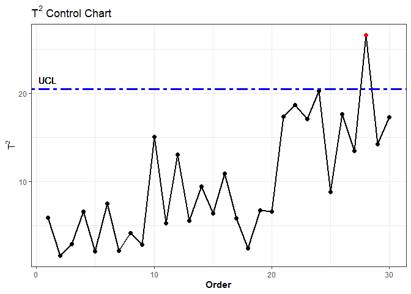

# missMSPC: Graphical Tools for Multivariate Statistical Process Control (MSPC) with Missing Data


<!-- badges: start -->
<!-- badges: end -->

The missMSPC package implements Hotelling’s *T*<sup>2</sup> chart of
principal components and Squared Prediction Error (SPE) control chart
for phases I and II. The estimation of scores for observations with
missing data is performed using CMR and TSR methods.

## Installation

<!-- You can install the released version of missMSPC from [CRAN](https://CRAN.R-project.org) with: -->
<!-- ``` r -->
<!-- install.packages("missMSPC") -->
<!-- ``` -->

You can install the development version of missMSPC from
[GitHub](https://github.com/DiegoNOB/missMSPC):

``` r
# install.packages("devtools")
devtools::install_github("DiegoNOB/missMSPC")
```

## Example

This example shows how to perform score imputation using the CMR method
and how to plot the phase II *T*<sup>2</sup> chart:

``` r
library(missMSPC)

#Score imputation with CMR method
scores <- score_imp(
  data1 = fruits1, #Phase I data (n = 36)
  data2 = fruits2na, #Phase II data with missing values
  A = 4, #number of principal componentes
  method = "CMR"
  )

#Hotelling's T2 chart of PCs
t2 <- t2.chart(
  scores = scores, 
  alpha = 0.005, #false alarm probability
  phase = 2, 
  m = 36 #sample size of phase I data
  )

#Proportion of out-of-control samples
t2$poc
#> [1] 0.03333333

#ID of out-of-control samples
t2$out
#> [1] 28

#Value of the Upper Control Limit
t2$UCL
#> [1] 20.5016

#Hotelling's T2 chart of PCs
t2$Plot
```


